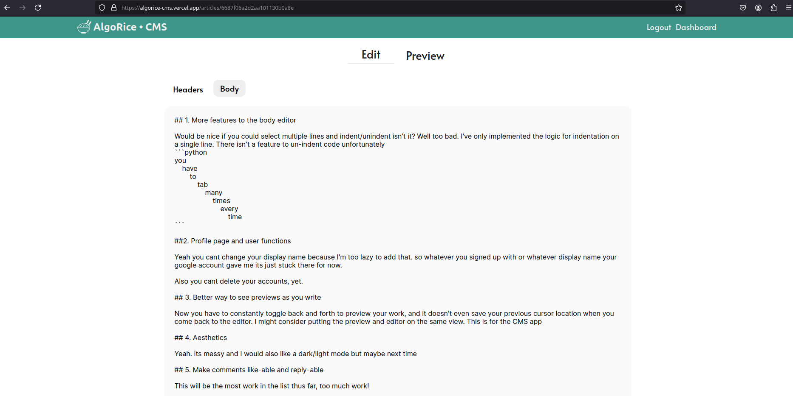
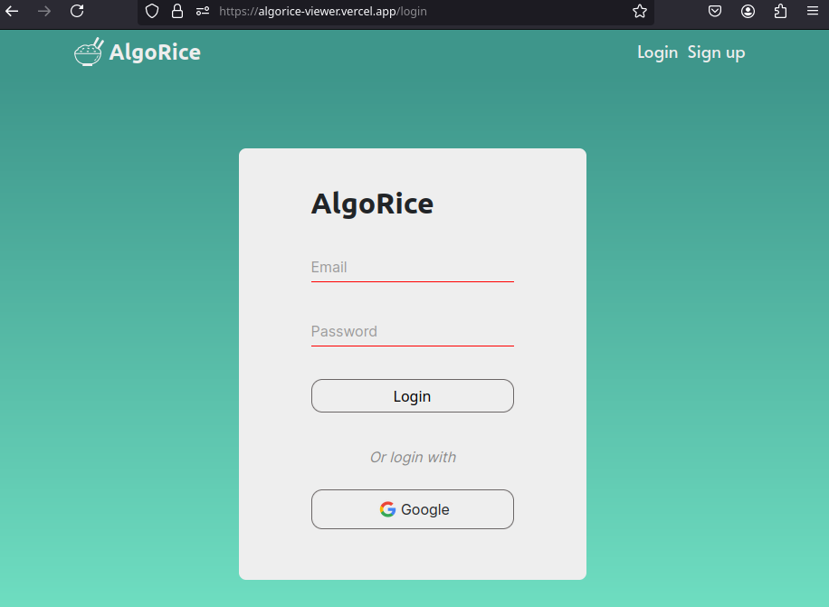
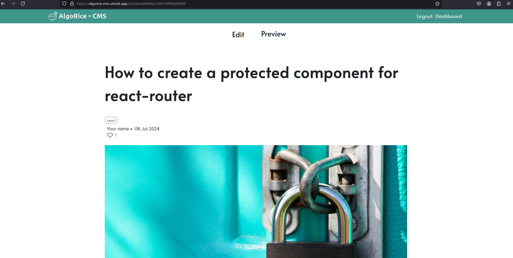
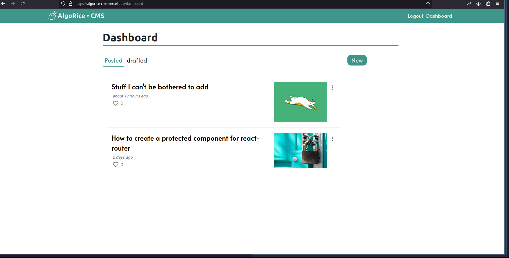

# CMS for Blog API Project
Content Management System built with ReactJS

### Live at: [blog cms](https://algorice-cms.vercel.app)

Viewer live at: [blog_viewer](https://algorice-viewer.vercel.app/)

link to [blog_api repo](https://github.com/Legalunicorn/blog-api)

link to [blog_view repo](https://github.com/Legalunicorn/blog-viewer)

## Key features
#### 1. Integration with markdown to format 

#### 2. Sign in with email or with google account

#### 3. Preview your work before you post

#### 4. Dashboard to manage articles that are drafted or posted

 

## Dependencies

- **date-fns** (format date of article with relative distance to now)
- **react-markdown** (ptocess markdown into formatted html elements)
- **react-syntax-highlighter** (used with react markdown to highlight syntax of code elements)
- **react-router-dom** (add client side routing)
- **react-spinners** (loading animation library)